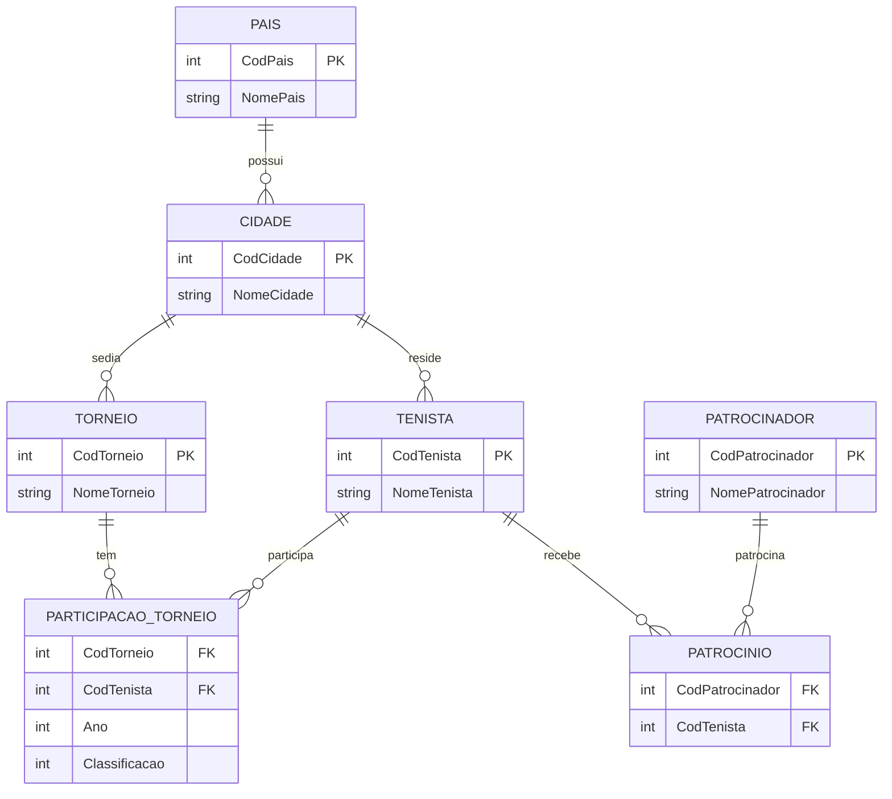

# Universidade Federal de Santa Maria  
## Curso Técnico em Informática – tarde   
### CPBAD101 – Banco de Dados – Turma: 21 – 2026/II

# **Torneios de tênis**: 
É necessário modelar um banco de dados que armazene dados sobre os torneios de tênis ao redor do mundo. Estes torneios fazem parte do calendário internacional de tênis. Exemplos de torneios são o de Roland Garros, o US Open, etc. 
1)	Sobre cada torneio deseja-se armazenar o código e o nome.
2)	Cada torneio é disputado em uma cidade e uma cidade pode ter diversos torneios. 
3)	Sobre cada cidade deseja-se armazenar o código e o nome. 
4)	É necessário vincular cada cidade a um país (um país possui obviamente várias cidades e uma cidade está em apenas um país). 
5)	Sobre o país deseja-se armazenar o código e o nome.
6)	De cada torneio podem participar diversos tenistas e um mesmo tenista poderá participar de diversos torneios. 
7)	Sobre cada tenista deseja-se armazenar o código e o nome. Um tenista está relacionado a uma cidade e uma cidade pode possuir vários tenistas.
8)	Deseja-se também armazenar a colocação de cada tenista em cada torneio por ele disputado.   
A.	 É importante considerar que um mesmo tenista pode disputar o mesmo torneio em anos diferentes. Assim, o Sr. Guga, por exemplo, pode participar de várias edições de Roland Garros.   
B.   Em diferentes anos do torneio o atleta pode ficar em diferentes colocações, por exemplo o Sr. Guga pode acabar ficando com o vigésimo (armazena numero inteiro 20 no banco de dados) lugar em 1995 e com o primeiro (armazena numero inteiro 1 no banco de dados) em 1997 no torneio Roland Garros.
10)	É ainda necessário armazenar dados sobre os patrocinadores atuais dos tenistas. 
11)	Sobre cada patrocinador deve ser armazenado o código e o nome.   
A.	Um patrocinador pode patrocinar vários tenistas e um tenista pode ser patrocinado por vários patrocinadores.

# Modelo ER:



# Modelo Lógico:   
**(Está em negrito chaves primárias)**
*(Está em itálico chaves estrangeiras)*
***(Está em negrito e itálico chaves primárias que são compostas por chaves estrangeiras)***

Pais (**CódigoPais**, NomePais)  

Cidade (**CódigoCidade**, NomeCIdade, *CódigoPaís*)   
	CódigoPaís Referencia País   
  
Torneio (**CódigoTorneio**, NomeTorneio, *CódigoCidade*)   
	CódigoCidade Referencia Cidade   
  
Tenista (**CódigoTenista**, NomeTenista, *CódigoCidade*)   
	CódigoCidade Referencia Cidade   
  
Patrocinador (**CódigoPatrocinador**, NomePatrocinador)   

Patrocina (***CódigoPatrocinador***, ***CódigoTenista***)   
	CódigoPatrocinador referencia Patrocinador    
	CódigoTenista Referencia Tenista   
  
Participa (***CódigoTenista***, ***CódigoTorneio***, **AnoTorneio**, Colocação)   
	CódigoTenista Referencia Tenista   
	CódigoTorneio Referencia Torneio   

# Modelo Físico / SQL:   

```sql
  CREATE TABLE pais (
     codpais integer NOT NULL,
     nomepais character varying (20),
  Primary Key (codpais));
  
  CREATE TABLE cidade (
      codcidade integer NOT NULL,
      nomecidade character varying(40),
      codpais integer NOT NULL,
  Primary Key (codcidade),
  Foreign Key (codpais) REFERENCES pais (codpais));
  
  CREATE TABLE torneio (
      codtorneio integer NOT NULL,
      nometorneio character varying(30),
      codcidade integer NOT NULL,
  Primary Key (codtorneio),
  Foreign Key (codcidade) REFERENCES cidade (codcidade));
  
  CREATE TABLE tenista (
      codtenista integer NOT NULL,
      nometenista character varying(30),
      codcidade integer NOT NULL,
  Primary Key (codtenista),
  Foreign Key (codcidade) REFERENCES cidade (codcidade));
  
  CREATE TABLE patrocinador (
     codpatrocinador integer NOT NULL,
     nomepatrocinador character varying (30),
  Primary Key (codpatrocinador));
  
  CREATE TABLE patrocina (
      codpatrocinador integer NOT NULL,
      codtenista integer NOT NULL,
  Primary Key (codpatrocinador, codtenista),
  Foreign Key (codpatrocinador) REFERENCES patrocinador (codpatrocinador),
  Foreign Key (codtenista) REFERENCES tenista (codtenista));
  
  CREATE TABLE participa (
      codtenista integer NOT NULL,
      codtorneio integer NOT NULL,
      anotorneio integer NOT NULL,
      colocacao integer,
  Primary Key (codtenista, codtorneio,anotorneio),
  Foreign Key (codtenista) REFERENCES tenista (codtenista),
  Foreign Key (codtorneio) REFERENCES torneio (codtorneio));
```

# Exercícios:

1)	Insira pelo menos 5 países
2)	Insira pelo cidades: São Paulo, Madri, França, Califórnia e Rio de janeiro
3)	Insira torneios para essas cidades
4)	Insira tenistas de diferentes nacionalidades 
5)	Liste todos os países cadastrados
6)	Liste as cidades com o nome da cidade e do país
7)	Liste todos os tenistas por ordem alfabética com o nome da sua cidade
8)	Liste todos os participantes desde 2020
9)	Entre com dados premiação (torneio e tenistas)
